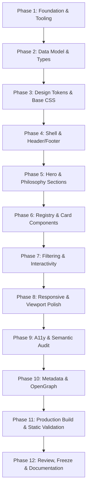

# Nalakara.com — Product Specification & Staged Implementation Plan

This document establishes the official product specification, content modeling, information architecture, visual principles, technical specification, and staged implementation plan for **nalakara.com** (v1).

---

## 1. Product Definition

### 1.1 Purpose
**Nalakara.com** is the parent ecosystem discovery layer, studio registry, and front door for Nalakara. It is designed to frame and contextualize ideas, experiments, internal tooling, and commercial products created across diverse domains under a unified, high-integrity umbrella.

### 1.2 Product Promise
> **"Nalakara is a studio and foundry that turns ideas into useful things."**

The website serves as an authentic window into what is being actively explored, what has matured into usable software/tools, and what is commercially available—without ever feeling like an artificial corporate facade or a cluttered ecommerce storefront.

### 1.3 Primary Audiences
1. **Curious Explorers & Early Adopters**: Engineers, designers, creators, and operators tracking active experiments, reading methodology/build notes, and testing raw laboratory tools.
2. **End-Users & Buyers**: Individuals or teams looking for practical, polished solutions they can immediately use (*Things you can use*) or purchase (*Things you can buy*).
3. **Collaborators & Partners**: Potential studio allies, clients, and peers interested in understanding Nalakara’s operating philosophy, craft standards, and engineering ethos.

### 1.4 Primary Visitor Journeys
* **Journey A: Ecosystem Discovery (The Foundry Path)**
  1. Lands on homepage hero; absorbs the core thesis and studio definition.
  2. Scans "Current Initiatives" to see what is currently active in the foundry.
  3. Explores the Registry grid, filtering by lifecycle phase (e.g., *Labs* vs. *Products*).
  4. Clicks an external/subdomain link (e.g., `roast.nalakara.com`) to experience the standalone product surface.
* **Journey B: Targeted Utility (The Direct Path)**
  1. Arrives via referral/direct link looking for a specific capability (e.g., Beauty Batch OS or B.R.O.S.).
  2. Quickly identifies lifecycle status (*Product* or *Commercial*) and availability.
  3. Clicks directly through to the product’s dedicated surface or onboarding page.
* **Journey C: Ethos & Contact (The Collaboration Path)**
  1. Navigates to the Philosophy / Principles section.
  2. Understands the rationale behind domain independence and tool craft.
  3. Accesses direct communication coordinates (email, GitHub, studio links).

### 1.5 Ecosystem Role vs. Commercial Role
* **Ecosystem Role (Primary)**: The authoritative registry and discovery index. It connects disparate initiatives and lets them evolve publicly.
* **Commercial Role (Secondary/Integrated)**: A clear, honest signpost for commercial offerings. Rather than hosting an embedded shopping cart or checkout flow in v1, it presents commercial items with clear tier/availability metadata and routes buyers directly to the appropriate transactional surface (e.g., subdomain checkout, Lemon Squeezy, or direct inquiry).

### 1.6 Success Criteria for v1
1. **Clarity**: A visitor understands within 5 seconds that Nalakara is a studio/foundry making distinct, real things.
2. **Taxonomy Integrity**: Projects are legibly classified across the 5 lifecycle stages without ambiguity.
3. **Speed & Lightness**: Sub-second load time, zero unnecessary client-side bloat, perfect Lighthouse scores (95+ across Performance, Accessibility, Best Practices, SEO).
4. **Independence Preservation**: The parent site feels authoritative yet neutral enough that linking out to wildly different product visual identities feels natural and intentional.

---

## 2. Information Architecture (v1)

In v1, the public experience is delivered as a **single-page-first editorial experience** with clean internal anchor targets and a structured content layer underneath.

```
┌────────────────────────────────────────────────────────┐
│                      nalakara.com                      │
├────────────────────────────────────────────────────────┤
│ 1. Header (Brand Mark + Anchor Nav + Studio Status)    │
│ 2. Hero & Thesis (Studio / Foundry Manifesto)          │
│ 3. Current Initiatives (Curated Highlights)            │
│ 4. The Registry (Full Filterable Index: Idea → Comm.)  │
│ 5. Studio Principles & Philosophy (Core Tenets)        │
│ 6. About & Coordinates (Contact, Colophon, Footer)     │
└────────────────────────────────────────────────────────┘
```

### Component & Navigation Matrix (v1 vs. Future)

| Element | v1 Implementation | Future Scope (v2+) |
| :--- | :--- | :--- |
| **Home / Hero** | Page Section (`#top`) | Dynamic visual hero / interactive canvas |
| **Current Initiatives** | Curated Section (`#current`) | Live telemetry / automated build feed |
| **The Registry** | Filterable Grid (`#registry`) | Dedicated search page + detailed case study routes (`/p/[slug]`) |
| **Philosophy** | Editorial Section (`#philosophy`) | Full essay / field notes index (`/notes`) |
| **About / Coordinates** | Footer & Colophon (`#about`) | Studio handbook & governance documentation |
| **Store / Checkout** | Outbound links to product checkouts | Integrated multi-product checkout / account layer |

---

## 3. Homepage Structure & Section Breakdown

### Section 1: Header / Top Bar
* **Purpose**: Establish immediate brand presence, ambient status, and swift anchor navigation.
* **Content**:
  * Wordmark / Monogram (`NALAKARA`).
  * Ambient status pill (`Foundry Active` / `Est. 2026`).
  * Minimal anchor navigation: `Initiatives`, `Registry`, `Philosophy`, `About`.
* **Hierarchy**: Subtle, fixed or sticky with high contrast and zero visual noise.

### Section 2: Hero & Thesis
* **Purpose**: Articulate the studio thesis with bold, confident typography.
* **Content**:
  * Primary statement: *"A studio and foundry turning ideas into useful things."*
  * Secondary paragraph: Explanation of the multi-domain ecosystem model (software, hardware, systems, experiments).
* **Primary CTA**: Smooth scroll down to `Explore Registry` (`#registry`).
* **Secondary CTA**: `Read Philosophy` (`#philosophy`).

### Section 3: Current Initiatives (Curated Spotlight)
* **Purpose**: Highlight 2–3 active, high-priority projects across different lifecycle stages to demonstrate breadth.
* **Content**: Featured cards displaying name, category, stage badge, concise summary, and direct link.
* **Relationship to Model**: Pulls items where `featured === true`.

### Section 4: The Registry (The Ecosystem Catalog)
* **Purpose**: The complete, filterable discovery index of all studio items.
* **Content**:
  * Segmented filter controls:
    * `All`
    * `Things We're Building` (*Idea, Lab, Project*)
    * `Things You Can Use` (*Product — Free/Open*)
    * `Things You Can Buy` (*Commercial*)
  * Card grid rendering each `EcosystemItem`.
  * Visual indicators for lifecycle status, category tags, and destination status (e.g., `Live on roast.nalakara.com`, `In Private Lab`, `Conceptual`).
* **Handling Unlaunched Items**: Non-active items display clear disabled/internal states (e.g., `Internal Lab`, `Private Alpha`, `No public link yet`) instead of broken dead links.

### Section 5: Studio Philosophy & Operating Principles
* **Purpose**: Provide the intellectual and operational foundation for why and how Nalakara builds.
* **Content**: 3–4 concise pillars:
  1. *Domain Independence*: Ideas are not constrained by a single industry vertical.
  2. *Utility over Novelty*: Every output must perform real, verifiable work.
  3. *Autonomous Identity*: Sub-products earn and wear their own distinct brand identity.
  4. *Evolutionary Rigor*: Ideas must graduate through structured stages before commercialization.

### Section 6: About, Colophon & Coordinates (Footer)
* **Purpose**: Direct points of contact, system colophon, and technical attribution.
* **Content**:
  * Direct contact email (`hello@nalakara.com` or configured address).
  * Outbound links: GitHub, Subdomains, Social/Studio profiles.
  * Colophon: Typeface specs, build stack (Next.js on Vercel), location/timezone.

---

## 4. Ecosystem Content Model (`EcosystemItem`)

The data model is formalized in TypeScript and stored in a static data file (`src/data/ecosystem.ts` or `src/data/ecosystem.json`).

```typescript
export type LifecycleStatus = 'idea' | 'lab' | 'project' | 'product' | 'commercial';

export type InitiativeCategory = 
  | 'software' 
  | 'digital-system' 
  | 'physical-good' 
  | 'service' 
  | 'experimental';

export type AccessModel = 
  | 'concept'          // Not accessible to public
  | 'private-alpha'    // Available to selected testers
  | 'public-beta'      // Usable via public URL
  | 'production'       // Fully live
  | 'commercial';      // Paid / commercially available

export interface EcosystemItem {
  // Identity
  id: string;                      // Unique slug (e.g. 'roast-navigator')
  name: string;                    // Display Title (e.g. 'Roast Navigator')
  tagline: string;                 // 1-sentence punchy summary
  description: string;             // 2-3 sentence contextual description
  
  // Classification
  status: LifecycleStatus;         // Lifecycle stage
  category: InitiativeCategory;   // Domain category
  accessModel: AccessModel;        // Practical availability
  
  // Destinations & Routing
  targetUrl?: string;              // Subdomain (e.g. 'https://roast.nalakara.com') or external URL
  isExternal: boolean;             // True if links outside root
  
  // Commercial Metadata (Optional for v1)
  commercial?: {
    pricingType: 'free' | 'one-time' | 'subscription' | 'custom';
    badgeLabel?: string;           // e.g. '$29 / kit' or 'Free Beta'
    actionLabel?: string;          // e.g. 'Get License', 'Order Batch'
  };
  
  // Presentation
  featured: boolean;               // Appears in "Current Initiatives" spotlight
  accentColor?: string;            // Subtle visual signature (optional)
  order: number;                   // Visual sort sequence
  updatedAt: string;               // ISO date string (e.g. '2026-08-01')
}
```

---

## 5. Lifecycle Status Semantics

To ensure consistent categorization now and in the future, each status is strictly defined:

| Status | Semantic Definition | Public Availability Expectation | Example Destination |
| :--- | :--- | :--- | :--- |
| **Idea** | A structured concept, thesis, or architectural draft. Not yet written as production code or manufactured. | **None** (Read-only concept card on registry). | No link / In-situ modal in future. |
| **Lab** | Active technical or physical experiment. Code exists, prototypes are being tested internally or with alpha users. | **Restricted / Experimental** (Private alpha or raw test preview). | `lab.nalakara.com/...` or unlinked. |
| **Project** | An actively developed, cohesive system or tool approaching stable utility, but still evolving rapidly. | **Public preview or staging**. | `[name].nalakara.com` (preview/beta). |
| **Product** | A mature, stable utility ready for public end-user adoption (can be free, open-source, or freemium). | **Fully public and operational**. | Dedicated subdomain (e.g., `bros.nalakara.com`). |
| **Commercial** | A product, physical item, license, or service available for direct purchase or enterprise contract. | **Transactional / Purchase available**. | Subdomain checkout or commercial portal. |

---

## 6. Seed Content Dataset (Mock Initiatives)

```typescript
export const ECOSYSTEM_INITIATIVES: EcosystemItem[] = [
  {
    id: 'bros',
    name: 'B.R.O.S.',
    tagline: 'Autonomous operations and system intelligence framework.',
    description: 'An operational backbone engineered for managing multi-agent tasks, workflows, and automated workspace telemetry.',
    status: 'project',
    category: 'software',
    accessModel: 'private-alpha',
    targetUrl: 'https://bros.nalakara.com',
    isExternal: true,
    featured: true,
    order: 1,
    updatedAt: '2026-08-15'
  },
  {
    id: 'roast-navigator',
    name: 'Roast Navigator',
    tagline: 'Precision sensory and roast curve intelligence for specialty coffee.',
    description: 'A thermodynamic and sensory tracking platform designed to evaluate roast kinetics, charge dynamics, and bean profiles.',
    status: 'product',
    category: 'digital-system',
    accessModel: 'production',
    targetUrl: 'https://roast.nalakara.com',
    isExternal: true,
    featured: true,
    commercial: {
      pricingType: 'free',
      badgeLabel: 'Public Utility'
    },
    order: 2,
    updatedAt: '2026-08-20'
  },
  {
    id: 'beauty-batch-os',
    name: 'Beauty Batch OS',
    tagline: 'Formulation, batch compliance, and inventory management system.',
    description: 'Specialized operating system built for independent cosmetic labs and artisanal compounders to track ingredients, formulations, and regulatory stability.',
    status: 'commercial',
    category: 'software',
    accessModel: 'commercial',
    targetUrl: 'https://beauty.nalakara.com',
    isExternal: true,
    featured: true,
    commercial: {
      pricingType: 'subscription',
      badgeLabel: 'Commercial License',
      actionLabel: 'Explore Platform'
    },
    order: 3,
    updatedAt: '2026-08-22'
  },
  {
    id: 'skill-factory',
    name: 'Nalakara Skill Factory',
    tagline: 'Modular agent skill synthesis and capability training pipeline.',
    description: 'A systematic lab environment for creating, benchmarking, and distributing specialized LLM tool skills and domain extensions.',
    status: 'lab',
    category: 'experimental',
    accessModel: 'private-alpha',
    targetUrl: undefined,
    isExternal: false,
    featured: false,
    order: 4,
    updatedAt: '2026-08-10'
  }
];
```

---

## 7. Visual Principles (Restrained Studio Direction)

* **Tone & Atmosphere**: Intelligent, calm, editorial, slightly raw, and unapologetically focused on substance.
* **Palette**: High-contrast monochromatic foundation (deep carbon blacks `#0a0a0a` / `#121212`, warm off-whites `#f7f7f5` / `#ededeb`, neutral stone grays `#7a7a78` / `#2a2a29`). Subtle accent highlights reserved only for status pills.
* **Typography**:
  * Monospace or crisp geometric sans for system metadata, status tags, and technical specs (`Space Mono`, `JetBrains Mono`, or clean system monospace).
  * Contemporary, high-legibility sans-serif for headlines and body text (`Inter`, `Plus Jakarta Sans`, or modern system sans stack).
* **Banned Patterns**:
  * ❌ No fluorescent multi-color mesh gradients.
  * ❌ No pseudo-3D floating isometric dashboard cards.
  * ❌ No decorative particle animations or spinning wireframes.
  * ❌ No generic "Build your dream SaaS with AI in 5 minutes" marketing tropes.

---

## 8. Technical Specification

### 8.1 Stack Selection
* **Framework**: **Next.js (App Router, static export compatible)**.
* **Language**: **TypeScript** for strict content model contracts and component props.
* **Styling**: **Vanilla CSS Modules + Global CSS Tokens** (`globals.css` with CSS custom properties). No heavy styling libraries; complete freedom to sculpt raw typographic hierarchies.
* **Icons**: Handcrafted inline SVG icons or `lucide-react` (lightweight, tree-shaken).
* **Deployment**: **Vercel** with zero-config CI/CD on Git push.

### 8.2 Directory Architecture
```
/ (project root)
├── public/
│   ├── favicon.ico
│   ├── og-image.png
│   └── robots.txt
├── src/
│   ├── app/
│   │   ├── layout.tsx         # Root HTML, SEO tags, font loading
│   │   ├── page.tsx           # Assembled single-page homepage
│   │   ├── globals.css        # CSS variables, reset, typography tokens
│   │   └── page.module.css    # Layout shell styling
│   ├── components/
│   │   ├── Header.tsx         # Wordmark, ambient status, anchor nav
│   │   ├── Hero.tsx           # Manifesto & thesis
│   │   ├── Initiatives.tsx    # Current spotlight / active work
│   │   ├── Registry.tsx       # Filterable catalog with lifecycle tabs
│   │   ├── ItemCard.tsx       # Reusable initiative presentation card
│   │   ├── StatusBadge.tsx    # Semantic lifecycle tag component
│   │   ├── Philosophy.tsx     # 4 Core tenets
│   │   └── Footer.tsx         # Coordinates, colophon, contact
│   ├── data/
│   │   └── ecosystem.ts       # Structured EcosystemItem dataset
│   └── types/
│       └── index.ts           # Type contracts (EcosystemItem, LifecycleStatus, etc.)
├── package.json
├── tsconfig.json
├── next.config.ts
└── README.md
```

---

## 9. Staged Implementation Plan



### Phase 1: Foundation & Tooling Setup
* **Objective**: Scaffold standard Next.js (App Router) project with TypeScript in clean root directory.
* **Files**: `package.json`, `tsconfig.json`, `next.config.ts`, `.gitignore`.
* **Acceptance Criteria**: `npm run dev` and `npm run build` execute without warnings.
* **Out of Scope**: Third-party UI component libraries, external state stores.

### Phase 2: Data Model & Types Definition
* **Objective**: Implement TypeScript type definitions and structured seed data for real initiatives.
* **Files**: `src/types/index.ts`, `src/data/ecosystem.ts`.
* **Acceptance Criteria**: Types strictly validate all entries; compiler errors if a required field is missing.
* **Out of Scope**: Database queries, external API fetches.

### Phase 3: Design Tokens & Typography Foundation
* **Objective**: Define CSS custom properties for spacing, typography, colors, and surface borders.
* **Files**: `src/app/globals.css`.
* **Acceptance Criteria**: System renders a disciplined, dark/subtle palette with clean typographic scales.
* **Out of Scope**: Excessive CSS animation frameworks.

### Phase 4: Layout Shell, Header & Footer
* **Objective**: Build page container, navigation bar with anchor links, and colophon footer.
* **Files**: `src/app/layout.tsx`, `src/components/Header.tsx`, `src/components/Footer.tsx`.
* **Acceptance Criteria**: Header and Footer are semantically marked up (`<header>`, `<footer>`) with working anchor jumping.

### Phase 5: Hero & Studio Philosophy Sections
* **Objective**: Implement the thesis statement and the four core principles.
* **Files**: `src/components/Hero.tsx`, `src/components/Philosophy.tsx`.
* **Acceptance Criteria**: Copy matches approved product promise; hierarchy is crisp and readable.

### Phase 6: Registry Cards & Status Badges
* **Objective**: Build the visual card (`ItemCard.tsx`) and the semantic badge (`StatusBadge.tsx`).
* **Files**: `src/components/ItemCard.tsx`, `src/components/StatusBadge.tsx`.
* **Acceptance Criteria**: Badges distinguish Idea, Lab, Project, Product, and Commercial with consistent styling.

### Phase 7: Registry Grid & Filter Controls
* **Objective**: Build the interactive registry with client-side category/status filtering.
* **Files**: `src/components/Registry.tsx`, `src/components/Initiatives.tsx`.
* **Acceptance Criteria**: Users can toggle between "All", "Things we're building", "Things you can use", and "Things you can buy" smoothly.

### Phase 8: Responsive Layout & Mobile Refinements
* **Objective**: Optimize layouts for mobile (375px+), tablet (768px), and desktop (1280px+).
* **Files**: Component `.module.css` files.
* **Acceptance Criteria**: Zero horizontal scrollbars, readable line lengths, touch targets > 44px.

### Phase 9: Accessibility & Keyboard Navigation
* **Objective**: Verify ARIA attributes, semantic headings (`h1` -> `h3`), tab indexes, and focus rings.
* **Files**: All components.
* **Acceptance Criteria**: Fully navigable via keyboard alone; passes high color-contrast ratios (WCAG AA).

### Phase 10: Metadata & SEO Optimization
* **Objective**: Configure OpenGraph, Twitter cards, JSON-LD Schema, and robots config.
* **Files**: `src/app/layout.tsx`, `public/robots.txt`.
* **Acceptance Criteria**: Valid OpenGraph previews and canonical metadata generated for `nalakara.com`.

### Phase 11: Production Build & Static Validation
* **Objective**: Run production export and test build artifacts.
* **Files**: `.next/`, `out/`.
* **Acceptance Criteria**: `npm run build` succeeds cleanly; static HTML bundle is generated.

### Phase 12: Review, Freeze & Documentation
* **Objective**: Verify all user-facing requirements, freeze v1 code, and document deployment readiness.
* **Files**: `README.md`, `walkthrough.md`.
* **Acceptance Criteria**: Documentation is updated with run/deploy instructions for Vercel.

---

## 10. Explicit Out-of-Scope List (v1)

To protect agility and ensure a rock-solid v1 release, the following are **strictly excluded**:
1. ❌ **No Database/Backend**: No PostgreSQL, Supabase, Firebase, or Prisma.
2. ❌ **No Authentication/Users**: No login, sign-up, user profiles, or sessions.
3. ❌ **No Embedded Ecommerce/Cart**: No shopping cart, Stripe Elements, or inventory tracking on the root site.
4. ❌ **No Headless CMS**: Content is authored in code/JSON for version control.
5. ❌ **No Automated Live Telemetry**: No WebSockets or streaming status feeds.
6. ❌ **No Client-side Analytics Bloat**: No heavy trackers.

---

## 11. Recommended Build Decision

* **Stack**: Next.js 15+ (App Router) + TypeScript + Vanilla CSS Modules.
* **Scope**: High-impact, responsive single-page ecosystem registry with structured local data.
* **Core Architectural Rationale**: Extreme performance, zero maintenance costs, rock-solid typing, and complete independence for subdomains.
* **Postponed to v2**: Multi-page detail routes (`/p/[slug]`), CMS integration, and native payment processing.

---
*Status: Ready for review and execution approval.*
